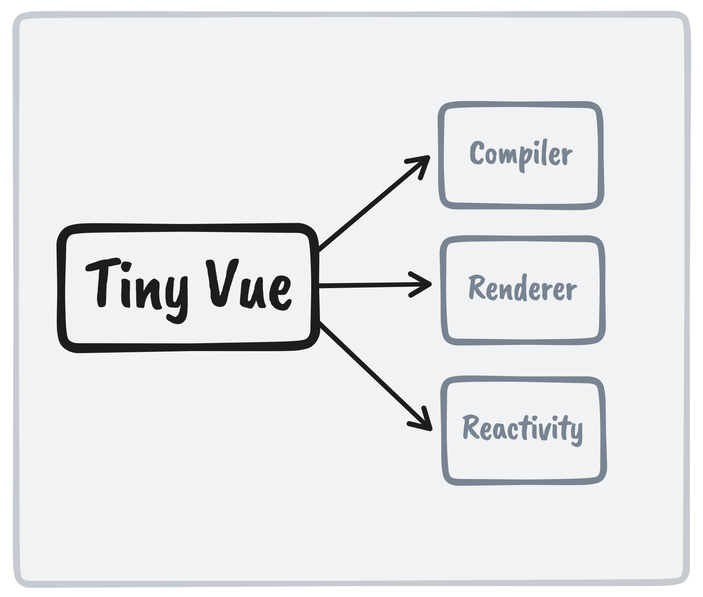

<h1 align="center">🧩 Tiny Vue</h1>
<p align="center">A minimal Vue 3.x framework (simple and lightweight). </p>

<p align='center'>

</p>

## Features

- Write unit and integration tests with [Vitest](https://vitest.dev) 
- TypeScript, of course

## Usage

1. use [degit](https://github.com/Rich-Harris/degit) to clone to your machine with an empty git history:

```bash
npx degit ooohmydawn/tiny-vue#main my-project
```
2. Install  dependencies
```bash
pnpm install
```
3. Build the project
```bash
pnpm build
```
And you will see the generated file in `lib` that ready to be served.
```html
  <!-- index.html -->
  <script  src="/lib/tiny-vue.global.js"></script>
  <!-- your code -->
```

## Contributing

1. Fork the Project
2. Create your Feature Branch (`git checkout -b feat/AmazingFeature`)
3. Commit your Changes (`git commit -m 'Add some AmazingFeature'`)
4. Push to the Branch (`git push origin feat/AmazingFeature`)
5. Open a Pull Request

## License

[MIT](./LICENSE) License © 2022 [ooohmydawn](https://github.com/ooohmydawn)
